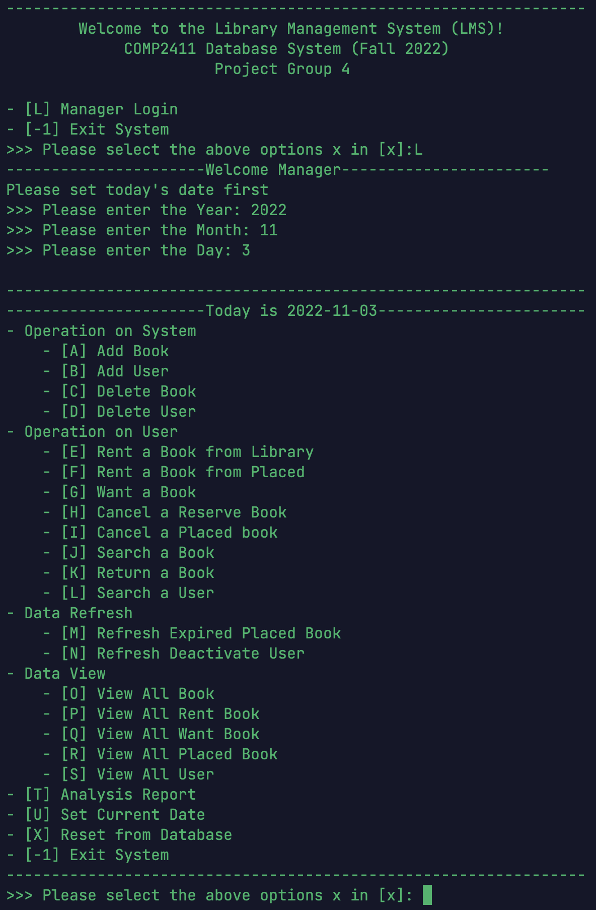

# Library Management System

---This Library Management System is a database project by Megha Bachiyani, B.E. CSBS student at Chandigarh University, inspired by a project from The Hong Kong Polytechnic University. It includes features like book search by title, author, or category, account deactivation for overdue books, reservation and checkout tracking, email or login notifications, and analysis reports for management. A user guide and demo are available for reference. This project is for self-learning and educational purposes only. All rights remain with the original creators, and no liability is accepted for errors, misuse, or content on external links.

## Demo

https://github.com/zhangwengyu999/Library_Management_System_Project/assets/68627255/eff4df6e-7cde-49fd-a1ba-4d9a1289d36b

---

</img>

---

## Features

1. A book catalogue with search by name, author and category of the books.  Note there may  be more than one copy of each book, and a book may even be published by different  publishers. 
2. The ability to deactivate a patron’s account if he/she does not return books after a specific period of time passes. 
3. Records of books checked out as well as placed on hold (i.e. “reserved” by a patron to make sure the book is there when he/she gets to the library to check it out). 
4. Notifications when the desired book becomes available and reminders that a book should be returned to the library.  Both could be sent by email and/or when patron logs in to the LMS. 
5. Provide analysis report to management to review the system.

For detailed features, please refer to [Project Report](https://github.com/zhangwengyu999/Library_Management_System_Project/blob/main/Project_Report.pdf).

---

## User Guide

For detailed user guide, please refer to [User Guide](https://github.com/zhangwengyu999/Library_Management_System_Project/blob/main/User_Guide.pdf).

---

Certain links in this website will lead to websites which are not under the control of ZHANG Wengyu. When you activate these you will leave ZHANG Wengyu's  website. ZHANG Wengyu has no control over and accepts no liability in respect of materials, products or services available on any website which is not under the control of ZHANG Wengyu.

To the extent not prohibited by law, in no circumstances shall ZHANG Wengyu be liable to you or any other third parties for any loss or damage (including, without limitation, damage for loss of business or loss of profits) arising directly or indirectly from your use of or inability to use, this site or any of the material contained in it.

